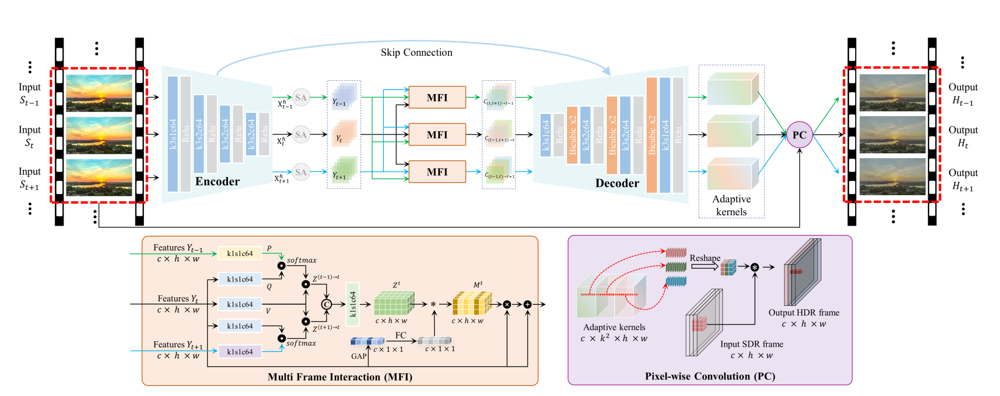

# KPN-MFI

### KPN-MFI: A Kernel Prediction Network with Multi-frame Interaction for Video Inverse Tone Mapping
Gaofeng Cao; Fei Zhou; Han Yan; Anjie Wang; Leidong Fang 

**This paper is accepted to IJCAI 2022.** 

## Overview
Simplified KPN-MFI pipeline:

### Dataset
The dataset we use is from [HDRTVNet](https://github.com/XPixelGroup/HDRTVNet)
 
@inproceedings{ijcai2022-113, 
  title     = {KPN-MFI: A Kernel Prediction Network with Multi-frame Interaction for Video Inverse Tone Mapping}, 
  author    = {Cao, Gaofeng and Zhou, Fei and Yan, Han and Wang, Anjie and Fan, Leidong}, 
  booktitle = {Proceedings of the Thirty-First International Joint Conference on
               Artificial Intelligence, {IJCAI-22}}, 
  publisher = {International Joint Conferences on Artificial Intelligence Organization}, 
  pages     = {806--812}, 
  year      = {2022}, 
  month     = {7}, 
  note      = {Main Track} 
  doi       = {10.24963/ijcai.2022/113}, 
  url       = {https://doi.org/10.24963/ijcai.2022/113}, 
}
